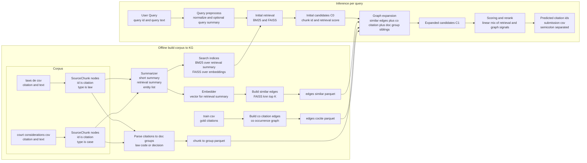

```mermaid
flowchart LR

subgraph A[Inference per query]
  direction LR
  Q[User Query<br/>query id and query text] --> QP[Query preprocess<br/>normalize and optional query summary]
  QP --> R0[Initial retrieval<br/>BM25 and FAISS]
  R0 --> C0[Initial candidates C0<br/>chunk id and retrieval score]
  C0 --> GE[Graph expansion<br/>similar edges plus co citation plus doc group siblings]
  GE --> C1[Expanded candidates C1]
  C1 --> RK[Scoring and rerank<br/>linear mix of retrieval and graph signals]
  RK --> OUT[Predicted citation ids<br/>submission csv<br/>semicolon separated]
end

subgraph B[Offline build corpus to KG]
  direction LR

  subgraph B1[Corpus]
    direction TB
    L[laws de csv<br/>citation and text] --> CH1[SourceChunk nodes<br/>id is citation<br/>type is law]
    CC[court considerations csv<br/>citation and text] --> CH2[SourceChunk nodes<br/>id is citation<br/>type is case]
  end

  CH1 --> SUM[Summarizer<br/>short summary<br/>retrieval summary<br/>entity list]
  CH2 --> SUM

  SUM --> SIDX[Search indices<br/>BM25 over retrieval summary<br/>FAISS over embeddings]

  SUM --> EMB[Embedder<br/>vector for retrieval summary]
  EMB --> KNN[Build similar edges<br/>FAISS knn top K]
  KNN --> ESIM[edges similar parquet]

  TR[train csv<br/>gold citations] --> COCI[Build co citation edges<br/>co occurrence graph]
  COCI --> ECO[edges cocite parquet]

  CH1 --> PARSE[Parse citations to doc groups<br/>law code or decision]
  CH2 --> PARSE
  PARSE --> EPO[chunk to group parquet]
end

SIDX --> R0
ESIM --> GE
ECO --> GE
EPO --> GE

```